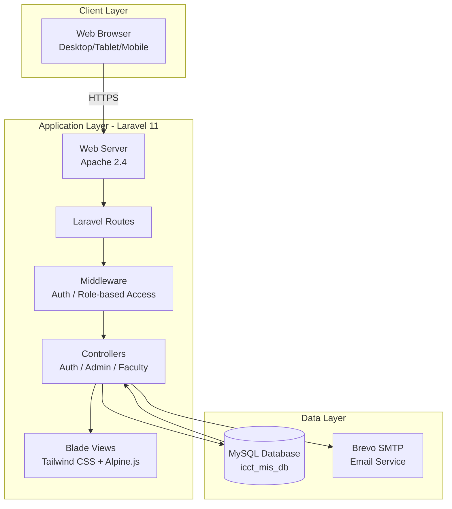
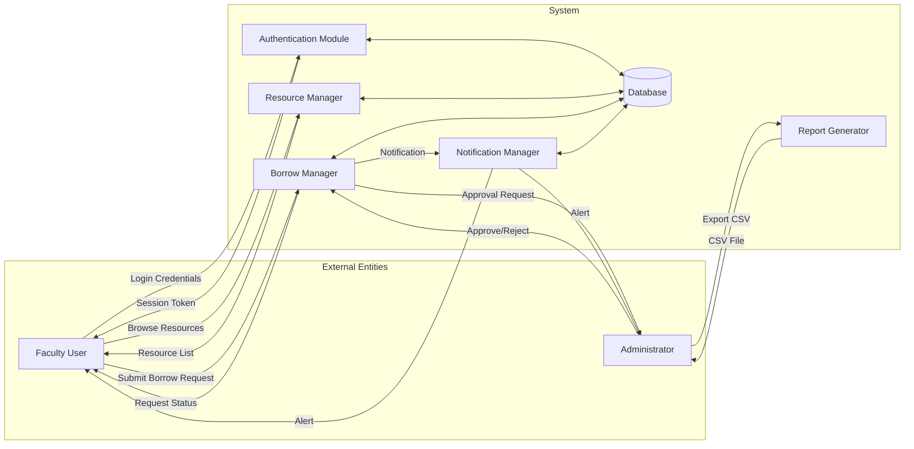
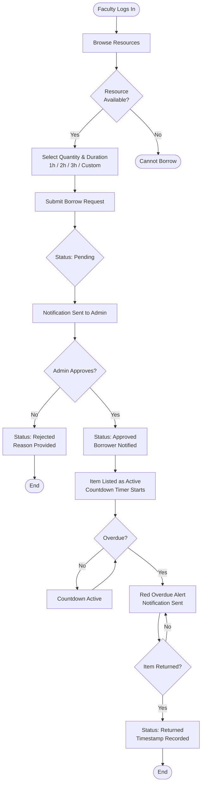
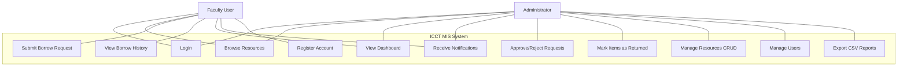
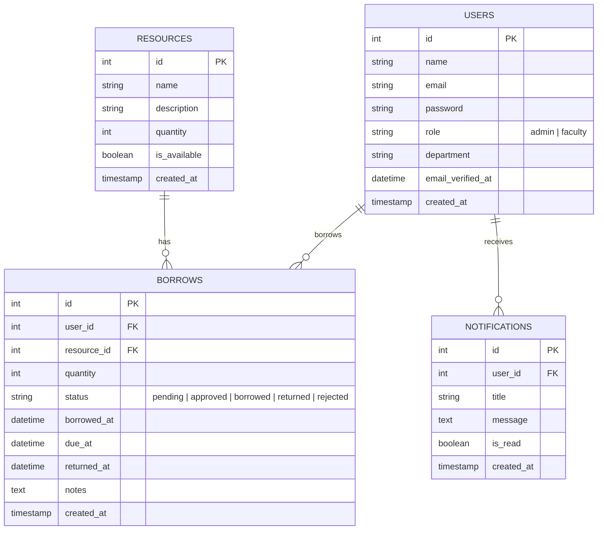

## System Architecture Diagram

```mermaid
graph TB
    subgraph "Client Layer"
        A[Web Browser<br/>Desktop/Tablet/Mobile]
    end

    subgraph "Application Layer - Laravel 11"
        B[Web Server<br/>Apache 2.4]
        C[Laravel Routes]
        D[Controllers<br/>Auth / Admin / Faculty]
        E[Blade Views<br/>Tailwind CSS + Alpine.js]
        F[Middleware<br/>Auth / Role-based Access]
    end

    subgraph "Data Layer"
        G[(MySQL Database<br/>icct_mis_db)]
        H[Brevo SMTP<br/>Email Service]
    end

    A -->|HTTPS| B
    B --> C
    C --> F
    F --> D
    D --> E
    D --> G
    D --> H
    G --> D
```

## Data Flow Diagram (DFD Level 0)

```mermaid
flowchart LR
    subgraph "External Entities"
        FAC[Faculty User]
        ADM[Administrator]
    end

    subgraph "System"
        AUTH[Authentication Module]
        RES[Resource Manager]
        BOR[Borrow Manager]
        NOTIF[Notification Manager]
        REPORT[Report Generator]
        DB[(Database)]
    end

    FAC -->|Login Credentials| AUTH
    AUTH -->|Session Token| FAC
    FAC -->|Browse Resources| RES
    RES -->|Resource List| FAC
    FAC -->|Submit Borrow Request| BOR
    BOR -->|Request Status| FAC
    BOR -->|Approval Request| ADM
    ADM -->|Approve/Reject| BOR
    BOR -->|Notification| NOTIF
    NOTIF -->|Alert| FAC
    NOTIF -->|Alert| ADM
    ADM -->|Export CSV| REPORT
    REPORT -->|CSV File| ADM
    AUTH <--> DB
    RES <--> DB
    BOR <--> DB
    NOTIF <--> DB
```

## Borrow Process Flowchart

```mermaid
flowchart TD
    START([Faculty Logs In]) --> BROWSE[Browse Resources]
    BROWSE --> CHECK{Resource<br/>Available?}
    CHECK -->|Yes| FORM[Select Quantity & Duration<br/>1h / 2h / 3h / Custom]
    CHECK -->|No| END1([Cannot Borrow])
    FORM --> SUBMIT[Submit Borrow Request]
    SUBMIT --> PENDING{Status: Pending}
    PENDING --> NOTIF_ADMIN[Notification Sent to Admin]
    NOTIF_ADMIN --> APPROVE{Admin Approves?}
    APPROVE -->|Yes| STATUS_APPROVED[Status: Approved<br/>Borrower Notified]
    APPROVE -->|No| STATUS_REJECTED[Status: Rejected<br/>Reason Provided]
    STATUS_REJECTED --> END2([End])
    STATUS_APPROVED --> DASHBOARD[Item Listed as Active<br/>Countdown Timer Starts]
    DASHBOARD --> DUE{Overdue?}
    DUE -->|No| COUNTDOWN[Countdown Active]
    COUNTDOWN --> DUE
    DUE -->|Yes| OVERDUE[Red Overdue Alert<br/>Notification Sent]
    OVERDUE --> RETURN{Item Returned?}
    RETURN -->|Yes| STATUS_RETURNED[Status: Returned<br/>Timestamp Recorded]
    RETURN -->|No| OVERDUE
    STATUS_RETURNED --> END3([End])
```

## Use Case Diagram

```mermaid
flowchart TB
    subgraph "ICCT MIS System"
        UC1[Login]
        UC2[Browse Resources]
        UC3[Submit Borrow Request]
        UC4[View Borrow History]
        UC5[View Dashboard]
        UC6[Receive Notifications]
        UC7[Approve/Reject Requests]
        UC8[Mark Items as Returned]
        UC9[Manage Resources CRUD]
        UC10[Manage Users]
        UC11[Export CSV Reports]
        UC12[Register Account]
    end

    FAC[Faculty User] --- UC1
    FAC --- UC2
    FAC --- UC3
    FAC --- UC4
    FAC --- UC5
    FAC --- UC6
    FAC --- UC12

    ADM[Administrator] --- UC1
    ADM --- UC2
    ADM --- UC5
    ADM --- UC6
    ADM --- UC7
    ADM --- UC8
    ADM --- UC9
    ADM --- UC10
    ADM --- UC11
```

## Entity Relationship Diagram (ERD)

```mermaid
erDiagram
    USERS ||--o{ BORROWS : "borrows"
    USERS ||--o{ NOTIFICATIONS : "receives"
    RESOURCES ||--o{ BORROWS : "has"

    USERS {
        int id PK
        string name
        string email
        string password
        string role "admin | faculty"
        string department
        datetime email_verified_at
        timestamp created_at
    }

    RESOURCES {
        int id PK
        string name
        string description
        int quantity
        boolean is_available
        timestamp created_at
    }

    BORROWS {
        int id PK
        int user_id FK
        int resource_id FK
        int quantity
        string status "pending | approved | borrowed | returned | rejected"
        datetime borrowed_at
        datetime due_at
        datetime returned_at
        text notes
        timestamp created_at
    }

    NOTIFICATIONS {
        int id PK
        int user_id FK
        string title
        text message
        boolean is_read
        timestamp created_at
    }
```
